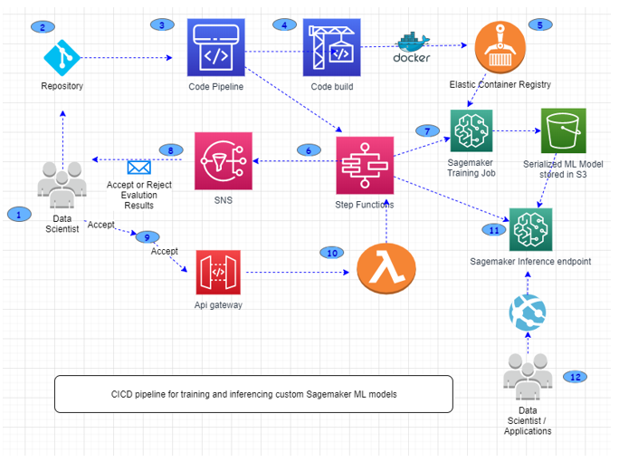
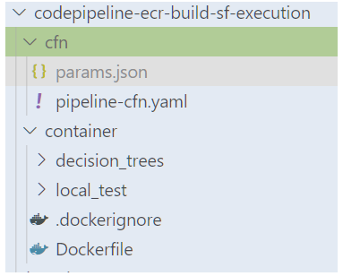

# CI/CD Pipeline for deploying custom Sagemaker ML models using AWS SAM and Step Functions
Automating the build and deployment of machine learning models is an important step in creating production ready machine learning services. Models need to be retrained and deployed when code and/or data are updated. This project provides an overview on use of Step Functions native service integrations with Sagemaker to train, deploy ML models, test results, and finally expose an inference endpoint using API Gateway and Lambda function. This Step Function also provides a way to wait for human approval, before the state transitions can progress towards final ML Model Inference endpoints configurations and deployment.

## Architecture

#### The following diagram describes the flow of the Step Function StateMachine. There are several points where the StateMachine has to poll and wait for a task to complete.
Code for creating and operating ML Ops pipeline is divided into <b>2 Github Repositories</b>, this is the second part repository, which focuses on building and deploying ML Models to ECR and executing the step functions created in first Github repo. 




## Prerequisites

- Set up an AWS account. ([instructions](https://AWS.amazon.com/free/?sc_channel=PS&sc_campaign=acquisition_US&sc_publisher=google&sc_medium=cloud_computing_b&sc_content=AWS_account_bmm_control_q32016&sc_detail=%2BAWS%20%2Baccount&sc_category=cloud_computing&sc_segment=102882724242&sc_matchtype=b&sc_country=US&s_kwcid=AL!4422!3!102882724242!b!!g!!%2BAWS%20%2Baccount&ef_id=WS3s1AAAAJur-Oj2:20170825145941:s))
- Configure AWS CLI and a local credentials file. ([instructions](http://docs.AWS.amazon.com/cli/latest/userguide/cli-chap-welcome.html))  
- Clone this repo.

```
  git clone https://github.com/aws-samples/codepipeline-ecr-build-sf-execution.git
```

## Setup
1. Open VS Code, and open the folder where repo was cloned. Folder structure should look like shown below 



2. To deploy this cloudformation template to AWS, follow below given steps, use the params.json file to input <b>your GitHubRepo, GitHubBranch, GitHubToken, GitHubUser and MlOpsStepFunctionArn.</b> Instructions to get value for MlOpsStepFunctionArn, can be found our [here](https://github.com/aws-samples/sam-sf-sagemaker-workflow).
```
aws cloudformation create-stack --stack-name codepipeline-ecr-build-sf-execution --template-body file://cfn/pipeline-cfn.yaml  --parameters file://cfn/params.json --capabilities CAPABILITY_NAMED_IAM
``` 
3. This cloudformation template will create the Code Pipeline, which will trigger code builds, from repository when a file changes are committed into to the container folder of the repo. (Usually this will happen, when data scientist would update the model development code and commit it to the repo.)

